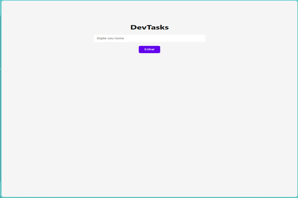

# DevTasks

Mini sistema funcional de tarefas com:

- Login simulado
- Dashboard dinâmico
- Modo escuro/claro
- Armazenamento com localStorage
- Layout responsivo

### Tecnologias usadas:
- HTML
- CSS
- JavaScript

### Preview:

### Como usar:
1. Clone o repositório
2. Abra o `index.html` no navegador

### Desenvolvido por:
[Bárbara De Andrade] — Siga no TikTok: [@2b_code](https://tiktok.com/@2b_code)
